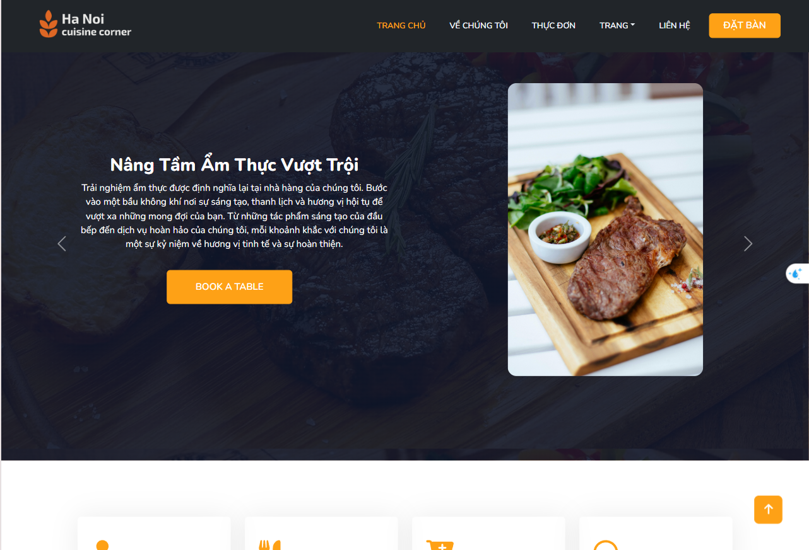
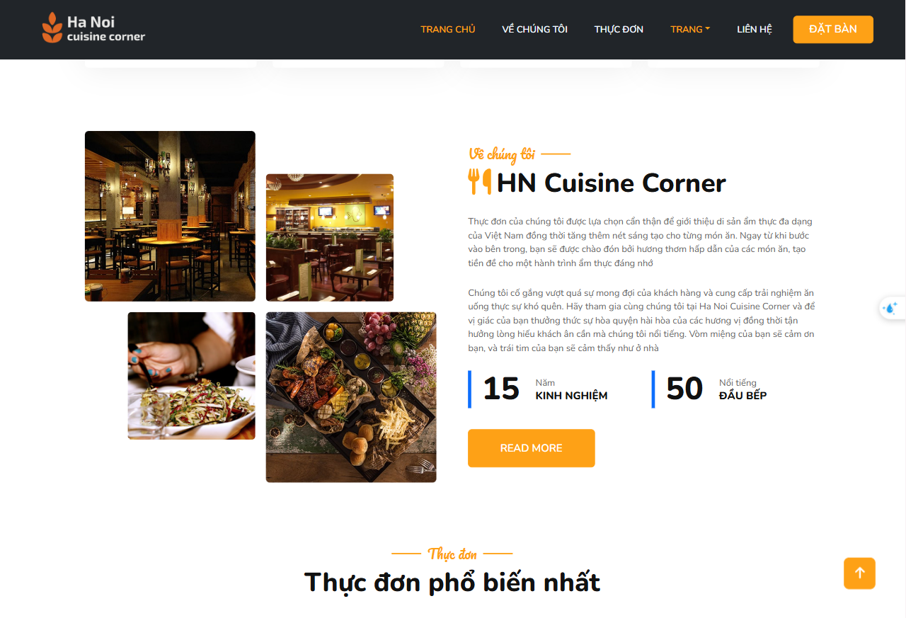
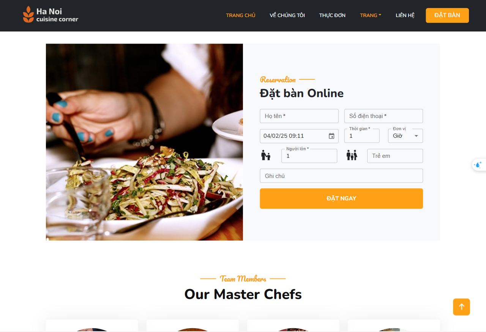

# Introduce
The website provides an overview of the history of the establishment and allows customers to book tables online.

# Overview

## Admin Website

- #### Dashboard 

- #### Menu Management 
Admin can CRUD menu

- #### Table Management 

Add new Table

Show history

- #### Provide accounts to employees

Employees can change their password after the account is created.

    